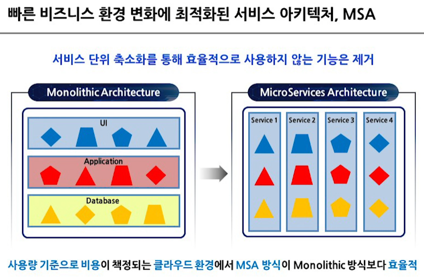
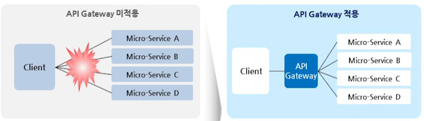
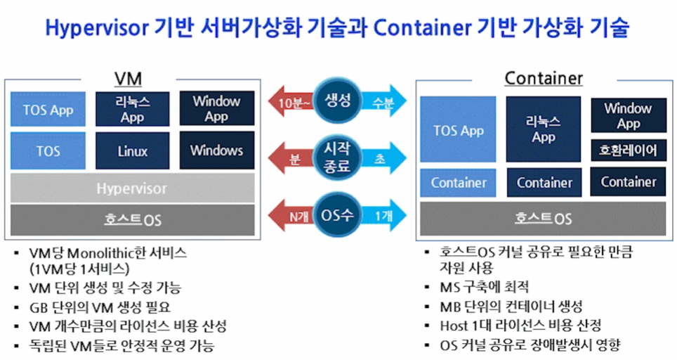

# vue-devops

## Project setup
```
yarn install
```

### Compiles and hot-reloads for development
```
yarn serve
```

### Compiles and minifies for production
```
yarn build
```

### Run your unit tests
```
yarn test:unit
```

### Lints and fixes files
```
yarn lint
```

### Customize configuration
See [Configuration Reference](https://cli.vuejs.org/config/).


## 1. Micro Services Architecture (MSA) 개요



#### 주요 장점
> * 신규 서비스 개발 시, 서비스 단위 개발에만 집중 가능
> * 개발 및 운영 생산성 향상
> * 자유로운 기술 확장
> * 서비스 장애 영향도 최소화를 통해 시스템 안정성 향상
> * Cloud 환경 상 운영 최적화
> * 서비스 연계/재활용 용이

#### 고려 사항
>* 서비스 및 데이터 호출 빈도, scale 단위 등을 고려한 서비스 설계 및 분리
>* 분산 시스템의 증가에 따른 관리의 어려움
>* 전체 Application 테스트의 어려움
>* 내부 통신 증가로 인한 Performance 감소

<br>
<br>

### MSA의 주요 기술 구성 요소
1. API Gateway
2. Message Queue
3. Service Registry
4. Service Monitoring

#### API Gateway

* 적용 시 장점
  * 시스템의 아키텍처는 내부로 숨기고, Client 요청에 대한 응답 역할 전담 (Encapsulation)
  * Client는 API Gateway와 약속된 API 경로만 알고있으면 됨.
  * Client와 Server Logic을 분리함으로써 De-Coupling 
  * 통합 로깅 및 모니터링, 공통 기능 처리

#### Messaging Queue
 * 서비스 간 Loosely Coupled한 연결과 서비스 재처리를 위해 사용.

#### Service Registry

#### Service Monitoring

<br>
<br>

## 2. VM과 Container의 장단점

* 가상화 종류
  * 서버 가상화
  * 데스크탑 가상화(VDI)
  * 어플리케이션 가상화

<br>  

* 가상화 장점
  * 유연성
  * 민첩성
  * 내결함성
  * 비용효율성

<br>

#### Container 개요
> Container는 모듈화되고 격리된 컴퓨팅 환경을 의미

<br>

#### VM과 Container 비교



## 3. Open Cloud Platform, HyperCloud
> * 안정성, 신뢰성, 규제, 컴플라이언스 이슈  
> * 대안으로서의 Multi Cloud 고민  
> * 자체적인 관리수준의 극대화 요구    
> 
> --> Private Cloud를 필수적으로 고려   
> --> 이것을 해결한 것이 k8s


#### k8s의 장점
* 벤더 및 플랫폼 종속성 0
* 뛰어난 확장성으로 Cloud Native 최적화
* 컨테이너 엔진, 네트워크, 스토리지, 표준 인터페이스 제공

#### k8s의 단점
* 사용이 어려움
* k8s에 대한 전문 지식 필요

#### 티맥스 클라우드의 방향
* 오픈소스 전략. 개방형 클라우드 추구
* 티맥스가 직접 오픈소스를 검증하고 기술지원을 제공

#### HyperCloud
* 쿠버네티스 기반 표준 클라우드 OS 제공


